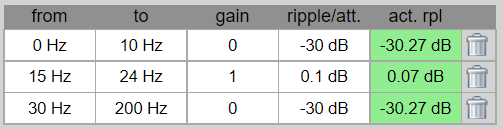
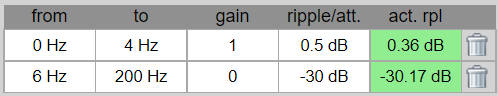
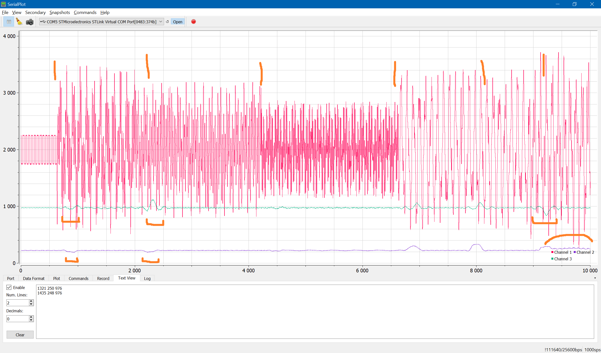

# Немного поигрался цифровыми фильтрами.
Задача - есть меандр 20 Гц и медленно изменяющийся постоянный сигнал (до 3 Гц). Наобходимо определить амплитуду меандтра (сигнал КС) и значение постоянного сигнала (сигнал ПС).

## Генерация коэффициентов
Есть примеры для matlab, python и т.п. Также существуют сайты, например, http://t-filter.engineerjs.com/ или https://fiiir.com/ .
На таких сайтах коэффициенты цифрового фильтра (КИХ) считаются онлайн, достаточно ввести нужные значения: фильтруемые частоты, частота опроса, величина подавления. Сразу генерируется программный код для C или для Python.

Полосовой фильтр КС и подавление:

ФНЧ для ПС:

## Оборудование
Для испытаний взял демоплату STM32F429I-DISC1, выход ЦАП соединил со входом АЦП. В процессоре STM32F429 (Cortex-M4 with FPU) рязрядность АЦП и ЦАП 12 бит. 

## Программное обеспечение
Разработка в stm32CubeMX + GNU-GCC + Makefile + vscode.

Для отображения графика взят [serialPlot](https://github.com/hyOzd/serialplot)

## Тестирование
Сигнал генерируется ЦАП через DMA 1000 раз в секунду. АЦП привязано к таймеру и преобразование выполняется 400 раз в секунду. 

Сигнал формируется из 4 составляющих (указаны единицы 12-разрядного ЦАП):
- ПС постоянный 2000 единиц
- КС меандр 20 ГЦ амплитудой 500 единиц.
- синусоида «шум» от 5 до 10 Гц, амплитуда от 100 до 1000 единиц (случайное число из диапазона)
- синусоида «шум» от 27 до 75 Гц, амплитуда от 100 до 1000 единиц.

На графике 3 линии АЦП красная, КС фиолетовая, ПС зеленая.
По оси Х идет время в миллисекундах.
В левой стороне графика сигнал без «шумов». Далее нажимаю кнопку на плате — меняются коэффициенты шумов. Оранжевой кисточкой показал когда нажимал кнопку. 
 
Значение КС считается как RMS. После применения цифрового фильтра сигналы КС и ПС меньше вдвое, но можно поставить усиление.

При некоторых «удачных» сочетаниях частоты шумов идёт биение КС (последний отрезок). Время выравнивания сигнала до пол секунды, но можно подбирать коэффициенты и длину усреднения КС при вычислении RMS. 

## Время вычисления
Для увеличения скорости все вычисления выполняются с целыми числами (int32).
- для ПС около 280 коэф
- для КС - 150
- RMS за 80 точек (за 200мс).

Итоговое время вычислений в микроконтроллере stm32f429 = 0.2 мс без использования DSP.
